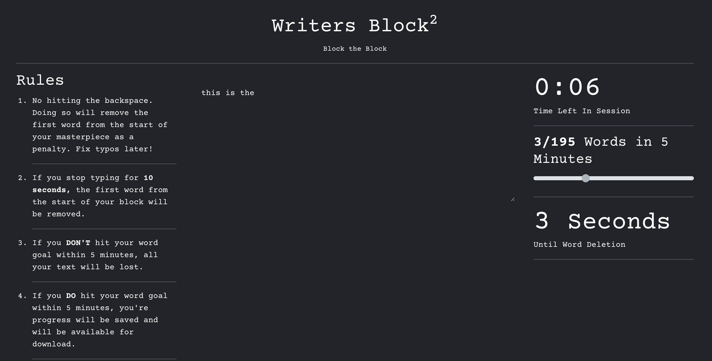

# Writer's Block Block (WB2)
A free, open source tool to block writers block.
If you would like to play with the tool, try out the live demo [here](https://tylerthecontentcreator.github.io/writers-block-block/).

## Rules

1. No hitting the backspace. Doing so will remove the first word from the start of your masterpiece as a penalty. Fix typos later!
   
2. If you stop typing for **10 seconds**, the first word from the start of your block will be removed.

3. If you **DON'T** hit your word goal within 5 minutes, all your text will be lost.

4. If you **DO** hit your word goal within 5 minutes, you're progress will be saved and will be available for download.

5. Start typing to get started